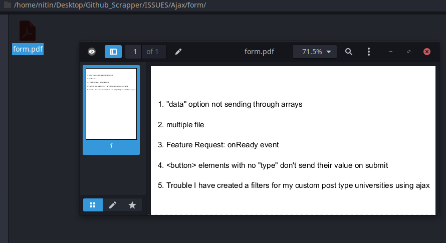
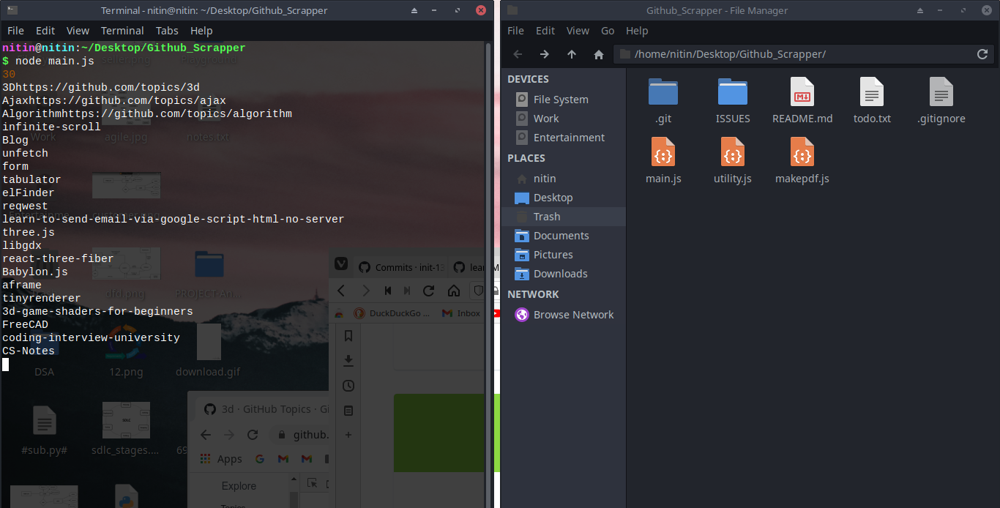
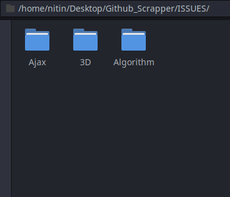

# Github_Scrapper
It scraps the github for the top 3 topics and their respective 8 repositories, and scraps the top 5 issues in them.

# Tech Stack Used
## NodeJS, cheerio, jspdf

## To run : 

> node main.js

# Screenshots

